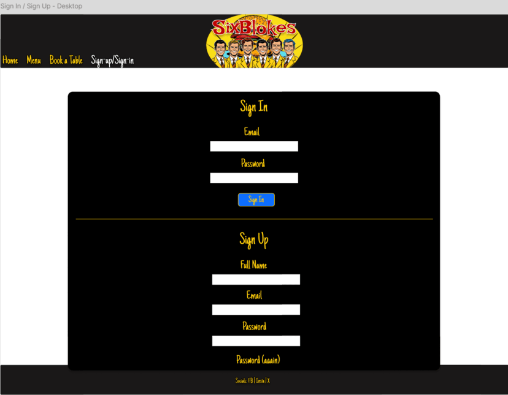
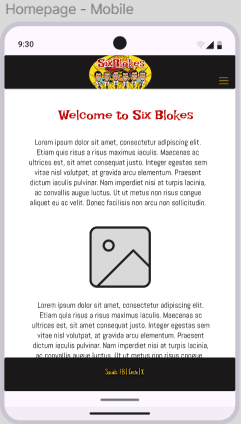
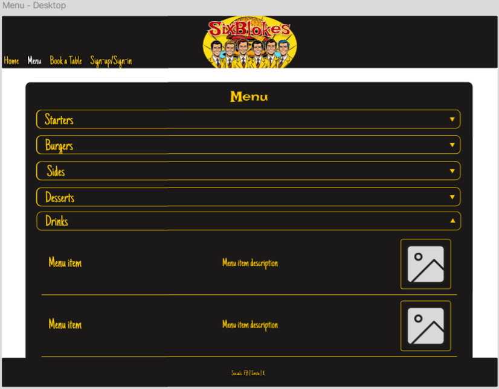
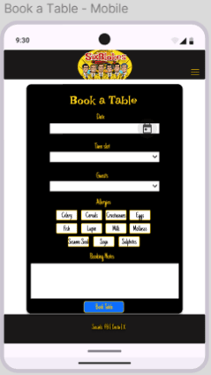
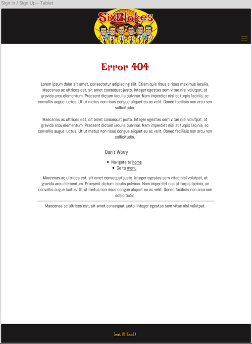
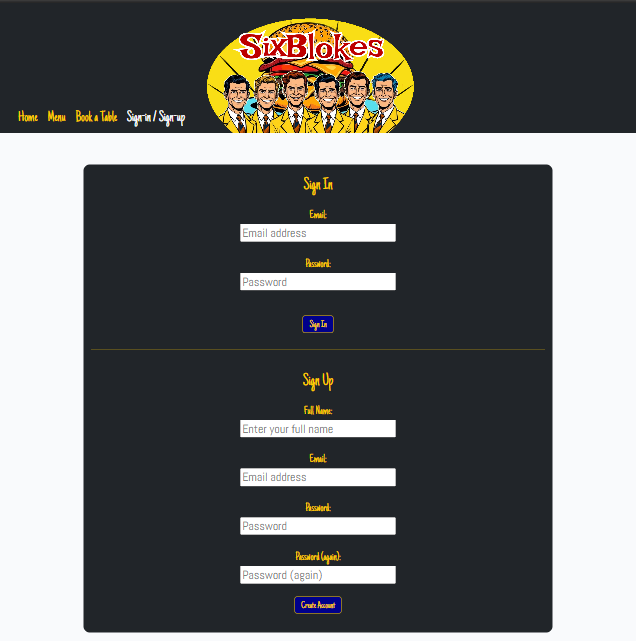
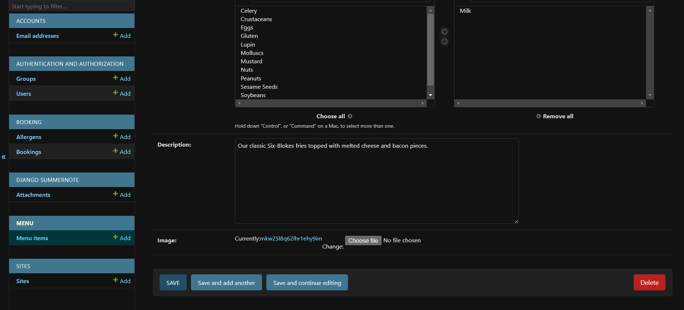
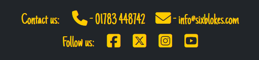
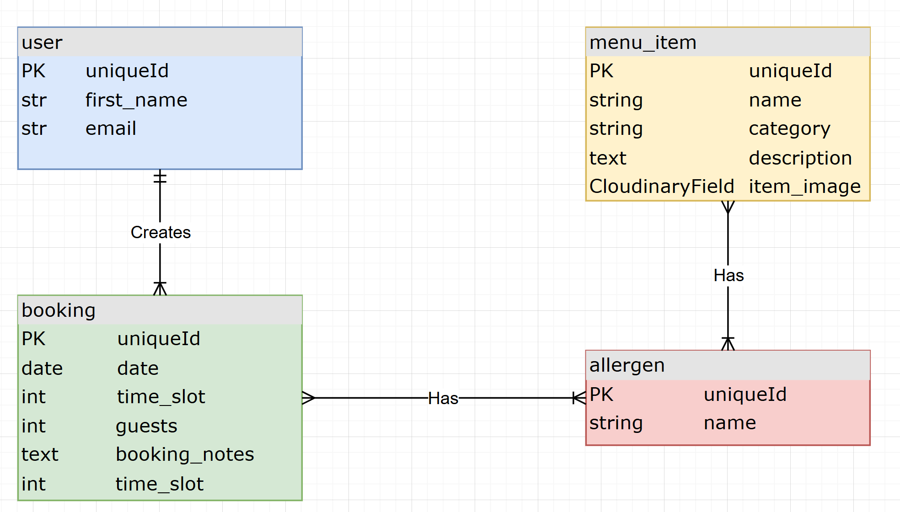
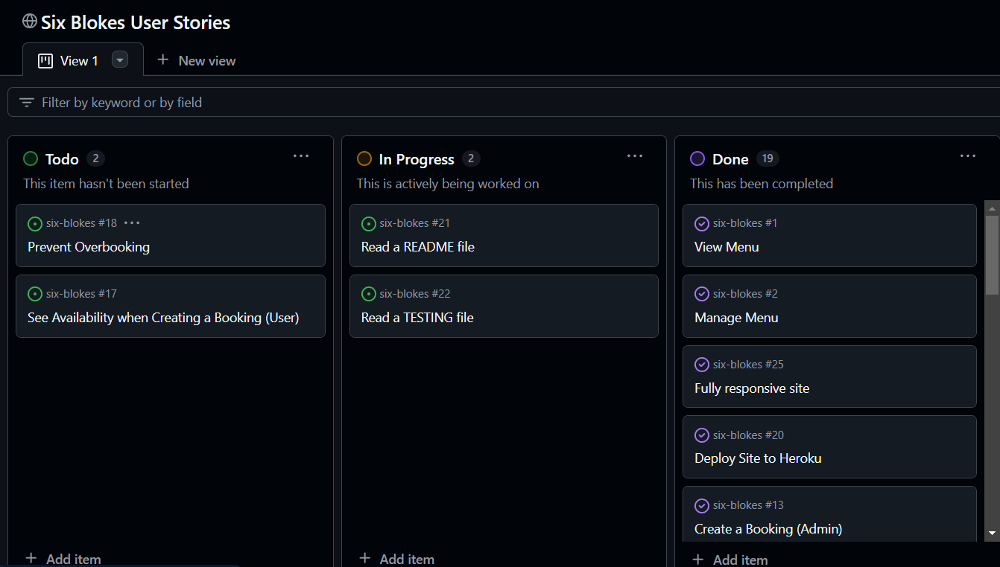

# [](https://six-blokes-6958fc1bfc25.herokuapp.com)

[](https://www.github.com/Ash-5p/six-blokes/commits/main)
[](https://www.github.com/Ash-5p/six-blokes/commits/main)
[](https://www.github.com/Ash-5p/six-blokes)

Welcome to Six Blokes, the UK's answer to Five Guys. This website's purpose is to promote the Six Blokes resturant by allowing users to view all the menu items on offer, and make, edit , and cancel reservations at the resturant.
The website also offers backend fuctionality which allows admin level users to view all existing bookings, and add, modify, and delete menu items on the live site.

Target Audience:
- Foodies
- Burger lovers
- Members of Six Blokes
- Anyone looking to taste the best burger of their life

**Site Mockups**


source: [six-blokes amiresponsive](https://ui.dev/amiresponsive?url=https://six-blokes-6958fc1bfc25.herokuapp.com)

> [!IMPORTANT]
> The examples in these templates are strongly influenced by the Code Institute walkthrough project called "I Think Therefore I Blog".

## UX

### The 5 Planes of UX

#### 1. Strategy Plane
##### Purpose
- Provide restaurant owners/staff with tools to create, manage, and delete bookings, and menu items.
- Offer users an intuitive platform to explore the restaurant's menu, and enable them to make/manage reservations.

##### Primary User Needs
- Restaurant owners/staff need seamless tools for viewing/managing customer bookings.
- Restaurant owners/staff need seamless tools for adding, removing, and modifying menu items.
- Registered users need the ability to create, modify, and delete their own bookings.
- Guests need the ability to browse the menu and view the homepage without registration.

##### Business Goals
- Provide a platform to draw in customers by simplifying the booking process.
- Allow easy browsing of a categorised menu, so users/guests can see all food on offer.
- Ensure easy menu content management for owners/staff.

#### 2. Scope Plane
##### Features
- A full list of [Features](#features) can be viewed in detail below.

##### Content Requirements
- Booking management (create, update, delete, and preview).
- Menu management (create, update, delete, and preview).
- User account features (register, log in, create/view/edit/delete bookings).
- 404 error page for lost users.

#### 3. Structure Plane
##### Information Architecture
- **Navigation Menu**:
  - Links to Home, Book a Table, Existing Bookings, Menu, Login/Register, and Dashboard (for site owners).
- **Hierarchy**:
  - Homepage showing image of resturant & owners, intuitive navbar for site navigation.
  - Menu is sorted using collapsable categories for easy browsing.
  - Clear call-to-action buttons for account creation and interaction (e.g., creating bookings).

##### User Flow
1. Guest users browse homepage/menu → view menu items via categorised menu.
2. Guest users register for an account → log in to create a booking.
3. Registered users creates booking → gets redirected to existing bookings page where they can view/edit/delete upcoming bookings.
4. Site owners/staff create, update, manage, and delete bookings → can create bookings on behalf of customers, allowing telephone bookings.
5. Site owners/staff create, update, manage, and delete menu items → keep menu up to date.

#### 4. Skeleton Plane
##### Wireframe Suggestions
- A full list of [Wireframes](#wireframes) can be viewed in detail below.

#### 5. Surface Plane
##### Visual Design Elements
- **[Colours](#colour-scheme)**: see below.
- **[Typography](#typography)**: see below.

### Colour Scheme

I used [coolors.co](https://coolors.co/ffcc00-212529-bd0000-f9fafc) to generate my color palette.

- `#FFCC00` primary text.
- `#212529` primary highlights.
- `#BD0000` secondary text.
- `#F9FAFC` secondary highlights.


### Typography

- [Irish Grover](https://fonts.google.com/specimen/Irish+Grover) was used for the primary headers and titles.
- [Abel](https://fonts.google.com/specimen/Abel) was used for paragraph text on homepage.
- [Just Another Hand](https://fonts.google.com/specimen/Just+Another+Hand) was used for all other secondary text.
- [Font Awesome](https://fontawesome.com) icons were used throughout the site, such as the social media icons in the footer.

## User Stories

| Target | Expectation | Outcome |
| --- | --- | --- |
| As a site admin | I would like to create, read, update and delete menu items | so that I can manage the menu when the resturant makes changes to its menu. |
| As a site admin | I would like to create bookings| so that I can create a booking on behalf of a customer who books via telephone or email. |
| As a site admin | I would like to edit bookings| so that I can edit a booking on behalf of a customer who books via telephone or email. |
| As a site admin | I would like to view bookings| so that I can plan accordingly few upcoming bookings. |
| As a site admin | I would like to delete bookings| so that I can cancel a booking on behalf of a customer who books via telephone or email. |
| As a site admin | I would like the site to prevent overbooking| so that I don't have to manually go through bookings to inform customers if we are fully booked. |
| As a registered user | I would like to log in to the site | so that I can create & manage bookings. |
| As a registered user | I would like to log out of my account | so that I can ensure my account is secure when not in use. |
| As a registered user | I would like to create bookings | so that I can reserve a table at the resturant for a desired date/timeslot. |
| As a registered user | I would like to view an list of my upcoming bookings (ordered by most recent) | so that I can see all my upcoming bookings in one place. |
| As a registered user | I would like my modify my existing bookings | so that I can adjust parts of my booking without having to create a new one if my plans change. |
| As a registered user | I would like delete my existing bookings | so that I can cancel a booking if I can no longer attend. |
| As a registered user | I would like to see the availibility of timeslots when booking | so that I know if the timeslot if free. |
| As a guest user | I would like to register for an account | so that I can create and manage bookings. |
| As a user | I would like to view the menu | so that I can see what the resturant has to offer. |
| As a user | I would like to view a homepage | so that I can read about the resturant, and what it specialises in. |
| As a user | I would like to see be able to contact the resturant | so that I can make bookings over the phone or by email. |
| As a user | I would like the site to scale correctly to my device size | so that I can comfortably view/use the site on all of my devices. |
| As a user | I would like to see links to the resturant's social media pages| so that I can follow them for news on any upcoming event, offers, menu changes, etc... |
| As a user | I would like to see a 404 error page if I get lost | so that it's obvious that I've stumbled upon a page that doesn't exist. |
| As a developer | I would like to see a README file | so that I can famliarise myself with all of the site's features, database schema, and any know issues/bugs before making contributions. |
| As a developer | I would like to see a TESTING file | so that I can see a document of all tests that have been conducted on the sites features, so I know they work as intened. |
| As a developer | I deploy the site to Heroku | so that I can test the features of the website through the develpment process, and test it on multiple browsers. |

## Wireframes

To follow best practice, wireframes were developed for mobile, tablet, and desktop sizes.
I've used [Figma](https://www.figma.com) to design my site wireframes.

| Page | Mobile | Tablet | Desktop |
| --- | --- | --- | --- |
| Signin / Signup |  |  |  |
| Home |  |  |  |
| Menu |  |  |  |
| Book a Table |  |  |  |
| Exisitng Booking |  |  |  |
| 404 |  |  |  |

## Features

### Existing Features

| Feature | Notes | Screenshot |
| --- | --- | --- |
| Register | Authentication is handled by allauth, allowing users to register accounts. |  |
| Login | Authentication is handled by allauth, allowing users to log in to their existing accounts. |  |
| Logout | Authentication is handled by allauth, allowing users to log out of their accounts. |  |
| Messages | Warnings and notifications are handled by Django's messages feature, and will display important errors/notifications under the header. |  |
| Create User (Admin) | Site Admins can create a user from the admin panel. |  |
| View User Info (Admin) | Site Admins can view a list of all users from the admin panel, as well as each individual user. |  |
| Edit User Info (Admin) | Site Admins can edit a user's information from the admin panel. |  |
| Delete User (Admin) | Site Admins can delete a user from the admin panel. |  |
| Homepage | The homepage displays basic information about the resturant, what it specialises in, and the names of it's founders. |  |
| Create Booking | Authenticated users can create a booking for a specific date & timeslot. The can also specify number of gustes, any allergens, and add additional notes |  |
| View Bookings | Authenticated users can view a list of their existing booking, which are ordered by most recent date. Any bookings that exist in the past will not be shown on the list. |  |
| Edit Booking | Authenticated users can edit their existing bookings. |  |
| Delete Booking | Authenticated users can delete their existing bookings. |  |
| Create Booking (Admin) | Site Admins can create a booking from the admin panel. |  |
| View Bookings (Admin) | Site Admins can view a list of all bookings from the admin panel, as well as each individual booking. |  |
| Edit Booking (Admin) | Site Admins can edit a booking from the admin panel. |  |
| Delete Booking (Admin) | Site Admins can delete a booking from the admin panel. |  |
| View Menu | Users can view a collapsable list of menu items categorised by Starter, Burger, Side, Dessert, or Drink. |  |
| Create Menu Item | Site admins can create menu items, including setting a menu image using Cloudinary, all from the Django admin dashboard. |  |
| View Menu Items (Admin Panel) | Site admins view a list of menu items from the admin panel. |  |
| Update Menu Item | Site admins can update/manage menu items from the Django admin dashboard. |  |
| Delete Menu Item | Site admins can delete menu items from the Django admin dashboard. |  |
| Create Allergen | Site admins can create allergens from the admin panel. |  |
| View Allergen | Site admins can view a list of all allergens from the admin panel, as well as viewing each individual allergen entry. |  |
| Edit Allergen | Site admins can edit allergens from the admin panel. |  |
| Delete Allergen | Site admins can delete allergens from the admin panel. |  |
| Header | The site header features the Six Blokes logo and a navbar with links to each of the sites pages. |  |
| Header (Mobile & Tablet) | The site header condenses the navbar down into a burger icon which will expand when clicked. |  |
| Navbar (Mobile & Tablet) | The navbar is shown when the burger icon is clicked on smaller screens. |  |
| Footer | The site footer features the resturant's phone number and email address, as well as clickable links to their social media accounts which open up in a new tab. |  |
| Heroku Deployment | The site is fully deployed to Heroku, making it accessible online and easy to manage. |  |
| 404 | The 404 error page will indicate when a user has navigated to a page that doesn't exist, replacing the default Heroku 404 page with one that ties into the site's look and feel. |  |

### Future Features

- **Prevent Overbooking**: Impliment logic to limit the number of guests that can be booked in for any given date/timeslot.
- **Show Booking Availibility**: Once the feature to prevent overbooking has been implimented, impliment a feature which will show users the number of seats availible for each date/timeslot combination.
- **Menu Sub-Categories**: Impliment secondary categories for each menu category to futher organise the menu. E.g Drinks - Milkshakes/Soft Drinks/ Alcoholoic Beverages.
- **Google Maps API**: Add an interactive map with the location of the resturant using an API.
- **Review System**: Implement a reviews page, so customers can leave feedback.
- **Account Managment Page**: Impliment a page where logged in users can manage/update aspects of their account.
- **Allergies info Linked to Account**: Allow users to select their own allergies when creating/modifying their account. This will enable these allergens to be preselected when creating a booking.
- **Menu Allergen Filter**: Add a filter feature which allows users to filter out items with one or more selected allergens.
- **Notifications**: Implement a notification system that alerts users when their bookings are approved.
- **Email Subscriptions**: Allow users to subscribe to receive email notifications for new deals, updates, or newsletters.

## Tools & Technologies

| Tool / Tech | Use |
| --- | --- |
| [](https://markdown.2bn.dev) | Generate README and TESTING templates. |
| [](https://git-scm.com) | Version control. (`git add`, `git commit`, `git push`) |
| [](https://github.com) | Secure online code storage. |
| [](https://gitpod.io) | Cloud-based IDE for development. |
| [](https://visualstudio.microsoft.com) | IDE for development. |
| [](https://en.wikipedia.org/wiki/HTML) | Main site content and layout. |
| [](https://en.wikipedia.org/wiki/CSS) | Design and layout. |
| [](https://www.javascript.com) | User interaction on the site. |
| [](https://www.python.org) | Back-end programming language. |
| [](https://www.heroku.com) | Hosting the deployed back-end site. |
| [](https://getbootstrap.com) | Front-end CSS framework for modern responsiveness and pre-built components. |
| [](https://www.djangoproject.com) | Python framework for the site. |
| [](https://www.postgresql.org) | Relational database management. |
| [](https://cloudinary.com) | Online static file storage. |
| [](https://whitenoise.readthedocs.io) | Serving static files with Heroku. |
| [](https://www.figma.com) | Creating wireframes. |
| [](https://fontawesome.com) | Icons. |
| [](https://chat.openai.com) | Help debug, troubleshoot, and explain things. |

## Database Design

### Data Model

Entity Relationship Diagrams (ERD) help to visualize database architecture before creating models. Understanding the relationships between different tables can save time later in the project.



⚠️ INSTRUCTIONS ⚠️

Using your defined models, create an ERD with the relationships identified. A couple of recommendations for building your own free ERDs:
- [Lucidchart](https://www.lucidchart.com/pages/ER-diagram-symbols-and-meaning)
- [Draw.io](https://draw.io)

Looking for an interactive version of your ERD? Consider using a [`Mermaid flowchart`](https://mermaid.live). To simplify the process, you can ask ChatGPT (or similar) the following prompt:

> ChatGPT Prompt:
> "Generate a Markdown syntax Mermaid ERD using my Django models"
> [paste-your-django-models-into-ChatGPT]

The "I Think Therefore I Blog" sample ERD in Markdown syntax using Mermaid can be seen below as an example.

**NOTE**: A Markdown Preview tool doesn't show the interactive ERD; you must first commit/push the code to your GitHub repository in order to see it live in action.

⚠️ --- END --- ⚠️

I have used `Mermaid` to generate an interactive ERD of my project.


source: [Mermaid](https://mermaid.live/edit#pako:eNqNUstuwjAQ_BVrz6EiVIiSG21zg9LyuFSRkImXxGpsR45TkQb-vU4C5REq4Yut2dnZnfWWECqG4AHqV04jTUUgiT3LuT8ju12no0ryPp0viEcCoLmJlc4CaHNeppOJ_9bQQiUESoMnZq1wgxnTS0rZvKuTGc1lRAw3CbbQLMmjExgmKmdcUl2QDVKTa2QrLmh0lmdwa0iobFPSXKG4DVGnZyijBg0XSEJt1ayWkjeCecpaQS6N7dB2kDXYvrmOjsurymvFijvLrpVKCE1Trb6RXYiPnqfLOwZ3NiMrsuEJ3jeif_3-eRuPbQuz0cKf-R9L_-YnSiraf4iC8uSqvMAsu2iq9m3ncfQMDgjUNpPZla0LBWBitPJQ7ROj-qtaqIpnl1XNCxmCZ3SODjQGDksO3oYmmUVTKsErYQue-zR8cN2B2-t3h73BY2_Qd6AAr7t34Ecpm-HW7M_63UhqlUfxQWr_C_zI_7I)

⚠️ RECOMMENDED ⚠️

Alternatively, or in addition to, a more comprehensive ERD can be auto-generated once you're at the end of your development stages, just before you submit. Follow the steps below to obtain a thorough ERD that you can include. Feel free to leave the steps below in the README for future use to yourself.

⚠️ --- END --- ⚠️

I have used `pygraphviz` and `django-extensions` to auto-generate an ERD.

The steps taken were as follows:
- In the terminal: `sudo apt update`
- then: `sudo apt-get install python3-dev graphviz libgraphviz-dev pkg-config`
- then type `Y` to proceed
- then: `pip3 install django-extensions pygraphviz`
- in my `settings.py` file, I added the following to my `INSTALLED_APPS`:
```python
INSTALLED_APPS = [
    ...
    'django_extensions',
    ...
]
```
- back in the terminal: `python3 manage.py graph_models -a -o erd.png`
- drag the new `erd.png` file into my `documentation/` folder
- removed `'django_extensions',` from my `INSTALLED_APPS`
- finally, in the terminal: `pip3 uninstall django-extensions pygraphviz -y`


source: [medium.com](https://medium.com/@yathomasi1/1-using-django-extensions-to-visualize-the-database-diagram-in-django-application-c5fa7e710e16)

## Agile Development Process

### GitHub Projects

[GitHub Projects](https://www.github.com/Ash-5p/six-blokes/projects) served as an Agile tool for this project. Through it, EPICs, User Stories, issues/bugs, and Milestone tasks were planned, then subsequently tracked on a regular basis using the Kanban project board.



### GitHub Issues

[GitHub Issues](https://www.github.com/Ash-5p/six-blokes/issues) served as an another Agile tool. There, I managed my User Stories and Milestone tasks, and tracked any issues/bugs.

| Link | Screenshot |
| --- | --- |
| [](https://www.github.com/Ash-5p/six-blokes/issues) |  |
| [](https://www.github.com/Ash-5p/six-blokes/issues?q=is%3Aissue+is%3Aclosed) |  |

### MoSCoW Prioritization

I've decomposed my Epics into User Stories for prioritizing and implementing them. Using this approach, I was able to apply "MoSCow" prioritization and labels to my User Stories within the Issues tab.

- **Must Have**: guaranteed to be delivered - required to Pass the project (*max ~60% of stories*)
- **Should Have**: adds significant value, but not vital (*~20% of stories*)
- **Could Have**: has small impact if left out (*the rest ~20% of stories*)
- **Won't Have**: not a priority for this iteration - future features

## Testing

> [!NOTE]
> For all testing, please refer to the [TESTING.md](TESTING.md) file.

## Deployment

The live deployed application can be found deployed on [Heroku](https://six-blokes-6958fc1bfc25.herokuapp.com).

### Heroku Deployment

This project uses [Heroku](https://www.heroku.com), a platform as a service (PaaS) that enables developers to build, run, and operate applications entirely in the cloud.

Deployment steps are as follows, after account setup:

- Select **New** in the top-right corner of your Heroku Dashboard, and select **Create new app** from the dropdown menu.
- Your app name must be unique, and then choose a region closest to you (EU or USA), then finally, click **Create App**.
- From the new app **Settings**, click **Reveal Config Vars**, and set your environment variables to match your private `env.py` file.

> [!IMPORTANT]
> This is a sample only; you would replace the values with your own if cloning/forking my repository.

| Key | Value |
| --- | --- |
| `CLOUDINARY_URL` | user-inserts-own-cloudinary-url |
| `DATABASE_URL` | user-inserts-own-postgres-database-url |
| `DISABLE_COLLECTSTATIC` | 1 (*this is temporary, and can be removed for the final deployment*) |
| `SECRET_KEY` | any-random-secret-key |

Heroku needs some additional files in order to deploy properly.

- [requirements.txt](requirements.txt)
- [Procfile](Procfile)

You can install this project's **[requirements.txt](requirements.txt)** (*where applicable*) using:

- `pip3 install -r requirements.txt`

If you have your own packages that have been installed, then the requirements file needs updated using:

- `pip3 freeze --local > requirements.txt`

The **[Procfile](Procfile)** can be created with the following command:

- `echo web: gunicorn app_name.wsgi > Procfile`
- *replace `app_name` with the name of your primary Django app name; the folder where `settings.py` is located*

For Heroku deployment, follow these steps to connect your own GitHub repository to the newly created app:

Either (*recommended*):

- Select **Automatic Deployment** from the Heroku app.

Or:

- In the Terminal/CLI, connect to Heroku using this command: `heroku login -i`
- Set the remote for Heroku: `heroku git:remote -a app_name` (*replace `app_name` with your app name*)
- After performing the standard Git `add`, `commit`, and `push` to GitHub, you can now type:
	- `git push heroku main`

The project should now be connected and deployed to Heroku!

### PostgreSQL

This project uses a [Code Institute PostgreSQL Database](https://dbs.ci-dbs.net) for the Relational Database with Django.

> [!CAUTION]
> - PostgreSQL databases by Code Institute are only available to CI Students.
> - You must acquire your own PostgreSQL database through some other method if you plan to clone/fork this repository.
> - Code Institute students are allowed a maximum of 8 databases.
> - Databases are subject to deletion after 18 months.

To obtain my own Postgres Database from Code Institute, I followed these steps:

- Submitted my email address to the CI PostgreSQL Database link above.
- An email was sent to me with my new Postgres Database.
- The Database connection string will resemble something like this:
    - `postgres://<db_username>:<db_password>@<db_host_url>/<db_name>`
- You can use the above URL with Django; simply paste it into your `env.py` file and Heroku Config Vars as `DATABASE_URL`.

### WhiteNoise

This project uses the [WhiteNoise](https://whitenoise.readthedocs.io/en/latest/) to aid with static files temporarily hosted on the live Heroku site.

To include WhiteNoise in your own projects:

- Install the latest WhiteNoise package:
    - `pip install whitenoise`
- Update the `requirements.txt` file with the newly installed package:
    - `pip freeze --local > requirements.txt`
- Edit your `settings.py` file and add WhiteNoise to the `MIDDLEWARE` list, above all other middleware (apart from Django’s "SecurityMiddleware"):

```python
# settings.py

MIDDLEWARE = [
    'django.middleware.security.SecurityMiddleware',
    'whitenoise.middleware.WhiteNoiseMiddleware',
    # any additional middleware
]
```


### Local Development

This project can be cloned or forked in order to make a local copy on your own system.

For either method, you will need to install any applicable packages found within the [requirements.txt](requirements.txt) file.

- `pip3 install -r requirements.txt`.

You will need to create a new file called `env.py` at the root-level, and include the same environment variables listed above from the Heroku deployment steps.

> [!IMPORTANT]
> This is a sample only; you would replace the values with your own if cloning/forking my repository.

Sample `env.py` file:

```python
import os

os.environ.setdefault("SECRET_KEY", "any-random-secret-key")
os.environ.setdefault("DATABASE_URL", "user-inserts-own-postgres-database-url")
os.environ.setdefault("CLOUDINARY_URL", "user-inserts-own-cloudinary-url")  # only if using Cloudinary

# local environment only (do not include these in production/deployment!)
os.environ.setdefault("DEBUG", "True")
```

Once the project is cloned or forked, in order to run it locally, you'll need to follow these steps:

- Start the Django app: `python3 manage.py runserver`
- Stop the app once it's loaded: `CTRL+C` (*Windows/Linux*) or `⌘+C` (*Mac*)
- Make any necessary migrations: `python3 manage.py makemigrations --dry-run` then `python3 manage.py makemigrations`
- Migrate the data to the database: `python3 manage.py migrate --plan` then `python3 manage.py migrate`
- Create a superuser: `python3 manage.py createsuperuser`
- Load fixtures (*if applicable*): `python3 manage.py loaddata file-name.json` (*repeat for each file*)
- Everything should be ready now, so run the Django app again: `python3 manage.py runserver`

If you'd like to backup your database models, use the following command for each model you'd like to create a fixture for:

- `python3 manage.py dumpdata your-model > your-model.json`
- *repeat this action for each model you wish to backup*
- **NOTE**: You should never make a backup of the default *admin* or *users* data with confidential information.

#### Cloning

You can clone the repository by following these steps:

1. Go to the [GitHub repository](https://www.github.com/Ash-5p/six-blokes).
2. Locate and click on the green "Code" button at the very top, above the commits and files.
3. Select whether you prefer to clone using "HTTPS", "SSH", or "GitHub CLI", and click the "copy" button to copy the URL to your clipboard.
4. Open "Git Bash" or "Terminal".
5. Change the current working directory to the location where you want the cloned directory.
6. In your IDE Terminal, type the following command to clone the repository:
	- `git clone https://www.github.com/Ash-5p/six-blokes.git`
7. Press "Enter" to create your local clone.

Alternatively, if using Gitpod, you can click below to create your own workspace using this repository.

[](https://gitpod.io/#https://www.github.com/Ash-5p/six-blokes)

**Please Note**: in order to directly open the project in Gitpod, you should have the browser extension installed. A tutorial on how to do that can be found [here](https://www.gitpod.io/docs/configure/user-settings/browser-extension).

#### Forking

By forking the GitHub Repository, you make a copy of the original repository on our GitHub account to view and/or make changes without affecting the original owner's repository. You can fork this repository by using the following steps:

1. Log in to GitHub and locate the [GitHub Repository](https://www.github.com/Ash-5p/six-blokes).
2. At the top of the Repository, just below the "Settings" button on the menu, locate and click the "Fork" Button.
3. Once clicked, you should now have a copy of the original repository in your own GitHub account!

### Local VS Deployment

⚠️ INSTRUCTIONS ⚠️

Use this space to discuss any differences between the local version you've developed, and the live deployment site. Generally, there shouldn't be [m]any major differences, so if you honestly cannot find any differences, feel free to use the following example:

⚠️ --- END --- ⚠️

There are no remaining major differences between the local version when compared to the deployed version online.

## Credits

### Content

⚠️ INSTRUCTIONS ⚠️

Use this space to provide attribution links for any borrowed code snippets, elements, and resources. Ideally, you should provide an actual link to every resource used, not just a generic link to the main site. If you've used multiple components from the same source (such as Bootstrap), then you only need to list it once, but if it's multiple Codepen samples, then you should list each example individually. If you've used AI for some assistance (such as ChatGPT or Perplexity), be sure to mention that as well. A few examples have been provided below to give you some ideas.

⚠️ --- END ---⚠️

| Source | Notes |
| --- | --- |
| [Markdown Builder](https://markdown.2bn.dev) | Help generating Markdown files |
| [Chris Beams](https://chris.beams.io/posts/git-commit) | "How to Write a Git Commit Message" |
| [I Think Therefore I Blog](https://codeinstitute.net) | Code Institute walkthrough project inspiration |
| [Bootstrap](https://getbootstrap.com) | Various components / responsive front-end framework |
| [Cloudinary API](https://cloudinary.com) | Cloud storage for static/media files |
| [Whitenoise](https://whitenoise.readthedocs.io) | Static file service |
| [Python Tutor](https://pythontutor.com) | Additional Python help |
| [WebAIM](https://webaim.org/resources/contrastchecker) | Check colour contrast for accessiblity |
| [ChatGPT](https://chatgpt.com) | Help with code logic and explanations |
| [GeeksforGeeks](https://www.geeksforgeeks.org/limit-the-maximum-value-of-a-numeric-field-in-a-django-model) | [booking/models.py](https://github.com/Ash-5p/six-blokes/blob/main/booking/models.py#L42-L44) |


### Media

| Source | Notes |
| --- | --- |
| [favicon.io](https://favicon.io/emoji-favicons/hamburger/) | Favicon |
| [I Think Therefore I Blog](https://codeinstitute.net) | Sample images provided from the walkthrough projects |
| [Font Awesome](https://fontawesome.com) | Icons used throughout the site |
| [DeepAI](https://deepai.org/) | AI generated artwork for Homepage & Menu images |
| [CloudConvert](https://cloudconvert.com/webp-converter) | Converting images to `.webp` |
| [GIMP](https://www.gimp.org/) | Editing image files |
| [Wikimedia](https://upload.wikimedia.org/wikipedia/commons/4/48/BLANK_ICON.png) | Placeholder image for menu |
| [removebg](https://www.remove.bg) | Removing background from images |
| [Image Resizer](https://imageresizer.com/) | Resize images for README file |


### Acknowledgements

- I would like to thank my Code Institute mentor, [Tim Nelson](https://www.github.com/TravelTimN) for the support throughout the development of this project.
- I would like to thank the [Code Institute](https://codeinstitute.net) Tutor Team for their assistance with troubleshooting and debugging some project issues.
- I would like to thank the [Code Institute Slack community](https://code-institute-room.slack.com) for the moral support; it kept me going during periods of self doubt and impostor syndrome.
- I would like to thank my partner, Lorna, for believing in me, and allowing me to make this transition into software development.

