# Testing

> [!NOTE]
> Return back to the [README.md](README.md) file.

## Code Validation

### HTML

| Directory | File | URL | Screenshot | Notes |
| --- | --- | --- | --- | --- |
| home | [index.html](https://github.com/Ash-5p/six-blokes/blob/main/home/templates/home/index.html) | [W3 Validator](https://validator.w3.org/nu/?doc=https%3A%2F%2Fsix-blokes-6958fc1bfc25.herokuapp.com%2F) |  | |
| booking | [booking.html](https://github.com/Ash-5p/six-blokes/blob/main/booking/templates/booking/booking.html) | N/A |  | Cannot provide w3 Validator link. Had to test via direct input due to authentication |
| booking | [booking_list.html](https://github.com/Ash-5p/six-blokes/blob/main/booking/templates/booking/booking_list.html) | N/A |  | Cannot provide w3 Validator link. Had to test via direct input due to authentication |
| menu | [menu.html](https://github.com/Ash-5p/six-blokes/blob/main/menu/templates/menu/menu.html) | [W3 Validator](https://validator.w3.org/nu/?doc=https%3A%2F%2Fsix-blokes-6958fc1bfc25.herokuapp.com%2Fmenu%2Fmenu%2F) |  | |
| users | [signin_signup.html](https://github.com/Ash-5p/six-blokes/blob/main/users/templates/users/signin_signup.html) | [W3 Validator](https://validator.w3.org/nu/?doc=https%3A%2F%2Fsix-blokes-6958fc1bfc25.herokuapp.com%2Fusers%2F) |  | |
| templates | [404.html](https://github.com/Ash-5p/six-blokes/blob/main/templates/404.html) | N/A |  | Cannot provide w3 Validator link. Had to test via direct input due to 404 error |


### CSS

I have used the recommended [CSS Jigsaw Validator](https://jigsaw.w3.org/css-validator) to validate all of my CSS files.

| Directory | File | URL | Screenshot | Notes |
| --- | --- | --- | --- | --- |
| static | [style.css](https://github.com/Ash-5p/six-blokes/blob/main/static/css/style.css) | [W3 Jigsaw](https://jigsaw.w3.org/css-validator/validator?uri=https://six-blokes-6958fc1bfc25.herokuapp.com) |  | Notes (if applicable) |


### JavaScript

I have used the recommended [JShint Validator](https://jshint.com) to validate all of my JS files.

| Directory | File | URL | Screenshot | Notes |
| --- | --- | --- | --- | --- |
| static | [bookings.js](https://github.com/Ash-5p/six-blokes/blob/main/static/js/bookings.js) | N/A |  | Bootstrap variables shown as undefined |
| static | [logout.js](https://github.com/Ash-5p/six-blokes/blob/main/static/js/logout.js) | N/A | 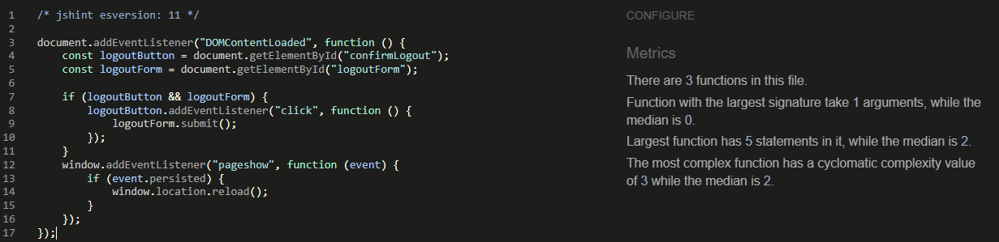 |  |
| static | [menu.js](https://github.com/Ash-5p/six-blokes/blob/main/static/js/menu.js) | N/A |  |  |


### Python

⚠️ INSTRUCTIONS ⚠️

The [CI Python Linter](https://pep8ci.herokuapp.com) can be used two different ways.

- Copy/Paste your Python code directly into the linter.
- As an API, using the "raw" URL appended to the linter URL.
    - To find the "raw" URL, navigate to your file directly on the GitHub repo.
    - On that page, GitHub provides a button on the right called "Raw" that you can click.
    - From that new page, copy the full URL, and paste it after the CI Python Linter URL (with a `/` separator).

It's recommended to validate each file using the API URL. This will give you a custom URL which you can use on your testing documentation. It makes it easier to return back to a file for validating it again in the future. Use the steps above to generate your own custom URLs for each Python file.

**IMPORTANT**: `E501 line too long` errors

You must strive to fix all Python lines that are too long (>80 characters). In rare cases where you cannot break the lines [*without breaking the functionality*], adding "`  # noqa`" (*NO Quality Assurance*) to the end of those lines will ignore linting validation. Do not use "`  # noqa`" all over your project just to clear down validation errors! This can still cause a project to fail, for failing to fix actual PEP8 validation errors.

Sometimes variables can get too long, or excessive `if/else` conditional statements. These are acceptable instances to use the "`  # noqa`" comment.

When trying to fix "line too long" errors, try to avoid using `/` to split lines. A better approach would be to use any type of opening bracket, and hit `<Enter>` just after that. Any opening bracket type will work: `(`, `[`, `{`. By using an opening bracket, Python knows where to appropriately indent the next line of code, without having to *guess* for yourself and attempt to "tab" to the correct indentation level.

⚠️ --- END --- ⚠️

🛑 IMPORTANT 🛑

**IMPORTANT**: Django settings

The Django `settings.py` file comes with 4 lines that are quite long, and will throw the `E501 line too long` error. This is default behavior, but can be fixed by adding the "`  # noqa`" comment at the end of those lines.

```python
AUTH_PASSWORD_VALIDATORS = [
    {
        "NAME": "django.contrib.auth.password_validation.UserAttributeSimilarityValidator",  # noqa
    },
    {
        "NAME": "django.contrib.auth.password_validation.MinimumLengthValidator",  # noqa
    },
    {
        "NAME": "django.contrib.auth.password_validation.CommonPasswordValidator",  # noqa
    },
    {
        "NAME": "django.contrib.auth.password_validation.NumericPasswordValidator",  # noqa
    },
]
```

**IMPORTANT**: *migration* and *pycache* files

You do not have to validate files from the `migrations/` or `pycache/` folders! Ignore these `.py` files, and validate just the files that you've created or modified.

🛑 --- END --- 🛑

I have used the recommended [PEP8 CI Python Linter](https://pep8ci.herokuapp.com) to validate all of my Python files.

| Directory | File | URL | Screenshot | Notes |
| --- | --- | --- | --- | --- |
| booking | [admin.py](https://github.com/Ash-5p/six-blokes/blob/main/booking/admin.py) | [PEP8 CI Link](https://pep8ci.herokuapp.com/https://raw.githubusercontent.com/Ash-5p/six-blokes/main/booking/admin.py) |  | |
| booking | [forms.py](https://github.com/Ash-5p/six-blokes/blob/main/booking/forms.py) | [PEP8 CI Link](https://pep8ci.herokuapp.com/https://raw.githubusercontent.com/Ash-5p/six-blokes/main/booking/forms.py) |  | |
| booking | [models.py](https://github.com/Ash-5p/six-blokes/blob/main/booking/models.py) | [PEP8 CI Link](https://pep8ci.herokuapp.com/https://raw.githubusercontent.com/Ash-5p/six-blokes/main/booking/models.py) |  | |
| booking | [tests.py](https://github.com/Ash-5p/six-blokes/blob/main/booking/tests.py) | [PEP8 CI Link](https://pep8ci.herokuapp.com/https://raw.githubusercontent.com/Ash-5p/six-blokes/main/booking/tests.py) |  | |
| booking | [urls.py](https://github.com/Ash-5p/six-blokes/blob/main/booking/urls.py) | [PEP8 CI Link](https://pep8ci.herokuapp.com/https://raw.githubusercontent.com/Ash-5p/six-blokes/main/booking/urls.py) |  | |
| booking | [views.py](https://github.com/Ash-5p/six-blokes/blob/main/booking/views.py) | [PEP8 CI Link](https://pep8ci.herokuapp.com/https://raw.githubusercontent.com/Ash-5p/six-blokes/main/booking/views.py) | 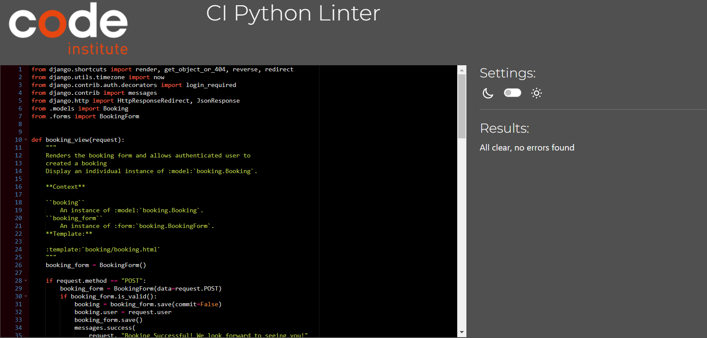 | |
| menu | [admin.py](https://github.com/Ash-5p/six-blokes/blob/main/menu/admin.py) | [PEP8 CI Link](https://pep8ci.herokuapp.com/https://raw.githubusercontent.com/Ash-5p/six-blokes/main/menu/admin.py) |  | |
| menu | [models.py](https://github.com/Ash-5p/six-blokes/blob/main/menu/models.py) | [PEP8 CI Link](https://pep8ci.herokuapp.com/https://raw.githubusercontent.com/Ash-5p/six-blokes/main/menu/models.py) | 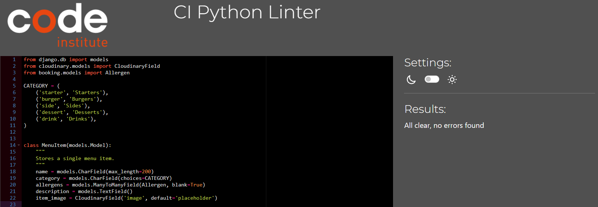 | |
| menu | [tests.py](https://github.com/Ash-5p/six-blokes/blob/main/menu/tests.py) | [PEP8 CI Link](https://pep8ci.herokuapp.com/https://raw.githubusercontent.com/Ash-5p/six-blokes/main/menu/tests.py) |  | |
| menu | [urls.py](https://github.com/Ash-5p/six-blokes/blob/main/menu/urls.py) | [PEP8 CI Link](https://pep8ci.herokuapp.com/https://raw.githubusercontent.com/Ash-5p/six-blokes/main/menu/urls.py) |  | |
| menu | [views.py](https://github.com/Ash-5p/six-blokes/blob/main/menu/views.py) | [PEP8 CI Link](https://pep8ci.herokuapp.com/https://raw.githubusercontent.com/Ash-5p/six-blokes/main/menu/views.py) |  | |
| home | [tests.py](https://github.com/Ash-5p/six-blokes/blob/main/home/tests.py) | [PEP8 CI Link](https://pep8ci.herokuapp.com/https://raw.githubusercontent.com/Ash-5p/six-blokes/main/home/tests.py) |  | |
| home | [urls.py](https://github.com/Ash-5p/six-blokes/blob/main/home/urls.py) | [PEP8 CI Link](https://pep8ci.herokuapp.com/https://raw.githubusercontent.com/Ash-5p/six-blokes/main/home/urls.py) |  | |
| home | [views.py](https://github.com/Ash-5p/six-blokes/blob/main/home/views.py) | [PEP8 CI Link](https://pep8ci.herokuapp.com/https://raw.githubusercontent.com/Ash-5p/six-blokes/main/home/views.py) |  | |
| users | [forms.py](https://github.com/Ash-5p/six-blokes/blob/main/users/forms.py) | [PEP8 CI Link](https://pep8ci.herokuapp.com/https://raw.githubusercontent.com/Ash-5p/six-blokes/main/users/forms.py) |  | |
| users | [tests.py](https://github.com/Ash-5p/six-blokes/blob/main/users/tests.py) | [PEP8 CI Link](https://pep8ci.herokuapp.com/https://raw.githubusercontent.com/Ash-5p/six-blokes/main/users/tests.py) |  | |
| users | [urls.py](https://github.com/Ash-5p/six-blokes/blob/main/users/urls.py) | [PEP8 CI Link](https://pep8ci.herokuapp.com/https://raw.githubusercontent.com/Ash-5p/six-blokes/main/users/urls.py) |  | |
| users | [views.py](https://github.com/Ash-5p/six-blokes/blob/main/users/views.py) | [PEP8 CI Link](https://pep8ci.herokuapp.com/https://raw.githubusercontent.com/Ash-5p/six-blokes/main/users/views.py) |  | |
|  | [manage.py](https://github.com/Ash-5p/six-blokes/blob/main/manage.py) | [PEP8 CI Link](https://pep8ci.herokuapp.com/https://raw.githubusercontent.com/Ash-5p/six-blokes/main/manage.py) |  | Notes (if applicable) |
| my_project | [settings.py](https://github.com/Ash-5p/six-blokes/blob/main/my_project/settings.py) | [PEP8 CI Link](https://pep8ci.herokuapp.com/https://raw.githubusercontent.com/Ash-5p/six-blokes/main/my_project/settings.py) |  | |
| my_project | [urls.py](https://github.com/Ash-5p/six-blokes/blob/main/my_project/urls.py) | [PEP8 CI Link](https://pep8ci.herokuapp.com/https://raw.githubusercontent.com/Ash-5p/six-blokes/main/my_project/urls.py) | 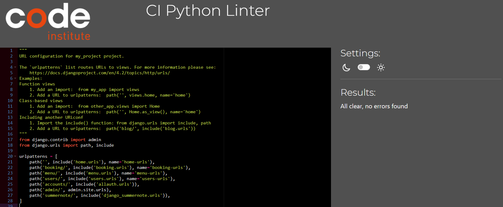 | |


## Responsiveness

I've tested my deployed project to check for responsiveness issues.

| Page | Mobile | Tablet | Desktop | Pixel 7 Pro | Notes |
| --- | --- | --- | --- | --- | --- |
| Signin/Signup |  | 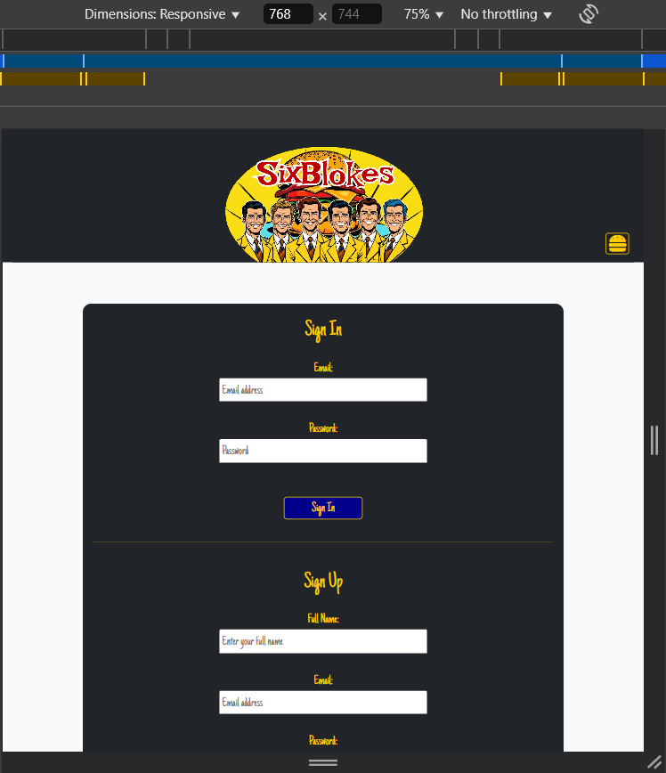 | 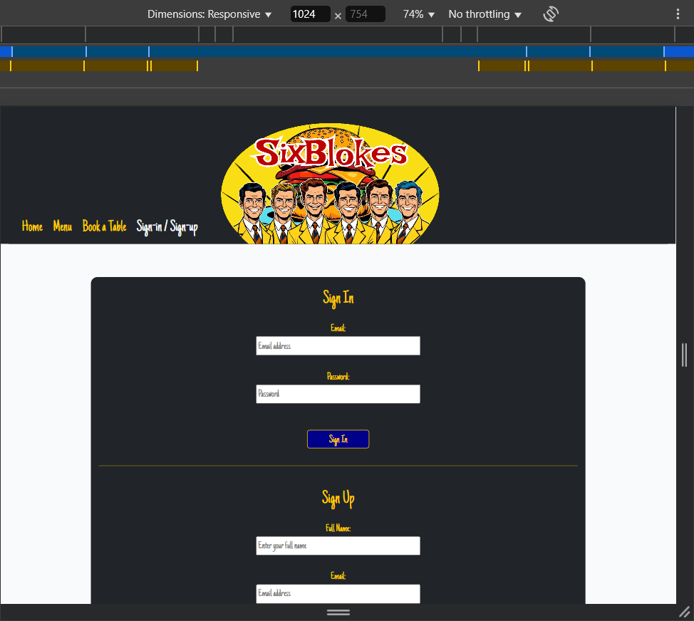 |  | Works as expected |
| Home |  |  |  |  | Works as expected |
| Menu |  |  |  |  | Works as expected |
| Book a Table |  |  |  |  | Works as expected |
| My Bookings |  |  |  |  | Works as expected |
| 404 |  |  |  |  | Works as expected |

## Browser Compatibility

I've tested my deployed project on multiple browsers to check for compatibility issues.

| Page | Chrome | Opera | Edge | Notes |
| --- | --- | --- | --- | --- |
| Signin/Signup |  |  |  | Works as expected |
| Home |  |  |  | Works as expected |
| Menu |  |  |  | Works as expected |
| Book a Table |  |  |  | Works as expected |
| My Bookings |  |  | 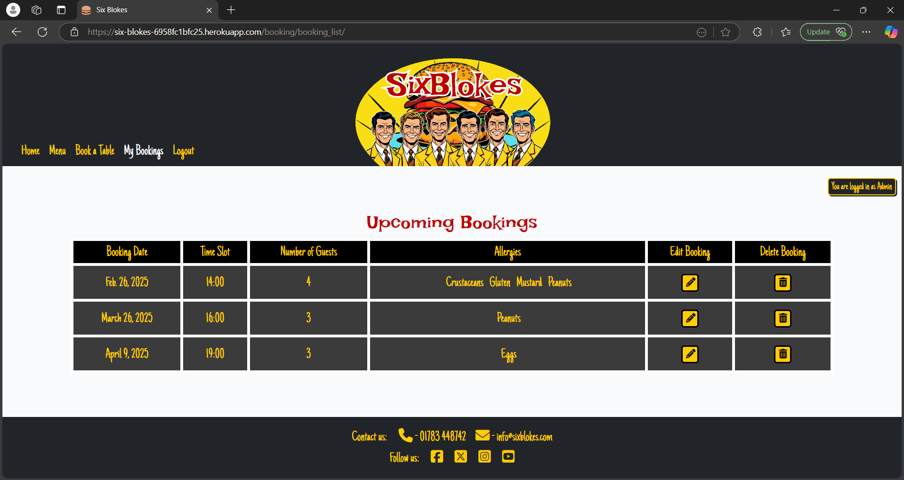 | Works as expected |
| 404 |  |  |  | Works as expected |

## Lighthouse Audit

I've tested my deployed project using the Lighthouse Audit tool to check for any major issues. Some warnings are outside of my control, and mobile results tend to be lower than desktop.

| Page | Mobile | Desktop | Notes |
| --- | --- | --- | --- |
| Signin/Signup |  |  | Some performance issues on mobile |
| Home | 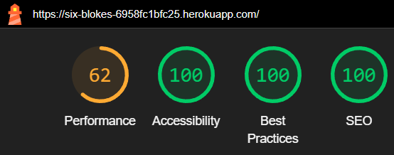 |  | Some performance issues |
| Menu | 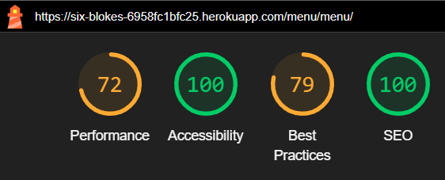 | 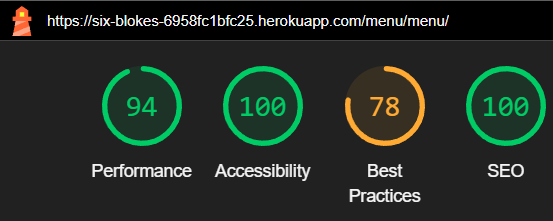 | Some performance issues, and best practices issue caused Cloudinary images not using HTTPS |
| Book a Table |  | 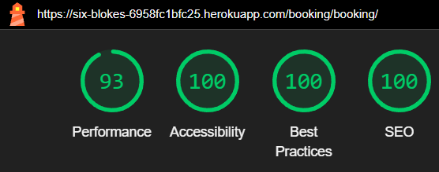 | Some performance issues on mobile |
| My Bookings |  |  | Some performance issues|
| 404 | 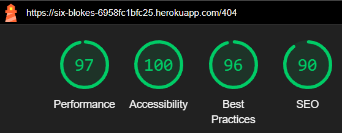 |  | Some minor performance issues, minor best practices & SEO issue caused by the error 404 status |

## Defensive Programming

Defensive programming was manually tested with the below user acceptance testing:

| Page | Expectation | Test | Result | Screenshot | Additional Screenshot |
| --- | --- | --- | --- | --- | --- |
| Booking Management | Feature is expected to allow the site admin to create new bookings with a user, date, time-slot, number of guests, one or more allergies, and booking notes. | Created a new booking with valid user, date, time-slot, number of guests, one or more allergies, and booking notes | Booking was created successfully and displayed correctly on the users booking list. |  |  |
| | Feature is expected to allow the site admin to update existing bookings. | Edited the content of an existing booking. | Booking was updated successfully with the new data. |  |  |
| | Feature is expected to allow the site admin to delete bookings. | Attempted to delete a booking, confirming the action before proceeding. | Booking was deleted successfully. |  | |
| | Feature is expected to retrieve a list of all bookings. | Accessed the site admin dashboard to view all bookings. | All bookings were displayed in a list view. |  | |
| Allergen Management | Feature is expected to allow the site admin to create new allergens with a name field. | Created a new allergen with a valid name | Allergen was created successfully. |  | |
| | Feature is expected to allow the site admin to update existing allergens. | Edited the name of an existing allergen. | Allergen was updated successfully with the new data. |  | |
| | Feature is expected to allow the site admin to delete allergens. | Attempted to delete an allergen, confirming the action before proceeding. | Allergen was deleted successfully. | 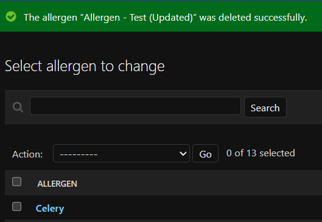 | |
| | Feature is expected to retrieve a list of all allergens. | Accessed the site admin dashboard to view all allergens. | All allergens were displayed in a list view. |  | |
| Menu Management | Feature is expected to allow the site admin to create new menu items with a name, category, one or more allergens, a description, and an image | Created a new menu item with valid a name, category, allergens, a description, and an image | Menu item was created successfully and displayed correctly on the menu page. |  |  |
| | Feature is expected to allow the site admin to update existing menu item. | Edited the content of an existing menu item. | Menu item was updated successfully with the new data. |  |  |
| | Feature is expected to allow the site admin to delete menu item. | Attempted to delete a menu item, confirming the action before proceeding. | Menu item was deleted successfully. |  | |
| | Feature is expected to retrieve a list of all menu items. | Accessed the site admin dashboard to view all menu items. | All menu items were displayed in a list view. |  | |
| User Authentication | Feature is expected to allow registered users to log in to the site. | Attempted to log in with valid and invalid credentials. | Login was successful with valid credentials; invalid credentials were rejected. | 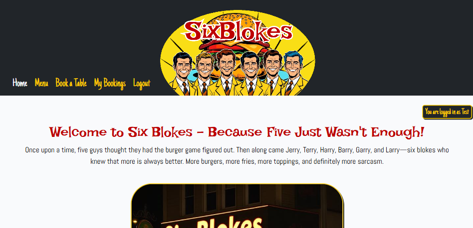 |  |
| | Feature is expected to allow users to register for an account. | Registered a new user with unique credentials with valid & invalid information. | User account was created successfully with valid information; invalid credentials rejected, and error message displayed |  |  |
| | Feature is expected to allow users to log out securely. | Logged out and tried accessing a restricted page. | "Book a Table" page can be accessed when logged out, however message informing user to login is rendered instead of booking form. If an attempt is made to access other restricted pages, the user is automatically redirected to the login page.  |  |  |
| User Bookings | Feature is expected to allow registered users to create bookings. | Logged in and submitted booking form with valid information. | Booking was successfully created and was visible on the users "My Bookings" page. |  | |
| | Feature is expected to allow registered users to update their existing bookings. | Logged in, went to the "My Bookings" page, and clicked the edit button on a booking, then changed the information in the modal with some different valid information and clicked "Save Changes". | Booking was successfully updated and was visible on the users "My Bookings" page. |  | |
| | Feature is expected to allow registered users to delete their existing bookings. | Logged in, went to the "My Bookings" page, and clicked the delete button on a booking, then confirmed the action before proceeding. | Booking was successfully deleted and was no longer visible on the users "My Bookings" page. |  | |
| | Feature is expected to retrieve a list of all of the logged in users bookings. | Logged in and went to the "My Bookings" page to view a list of all of the logged in users bookings. | All bookings belonging to the logged in user were displayed in a list view. |  | |
| Guest Features | Feature is expected to allow guest users to read the menu without registering. | Opened menu as a guest user. | Menu was fully accessible without logging in. |  |
| | Feature is expected to block standard users from brute-forcing admin pages. | Attempted to navigate to admin-only pages by manipulating the URL (e.g., `/admin`). | Access was blocked, and a message was displayed showing denied access. |  | |
| 404 Error Page | Feature is expected to display a 404 error page for non-existent pages. | Navigated to an invalid URL (e.g., `/test`). | A custom 404 error page was displayed as expected. |  | |

## User Story Testing

| Target | Expectation | Outcome | Screenshot/Link |
| --- | --- | --- | --- |
| As a site admin | I would like to create menu items| so that I can add new items when the resturant releases a new food item. | 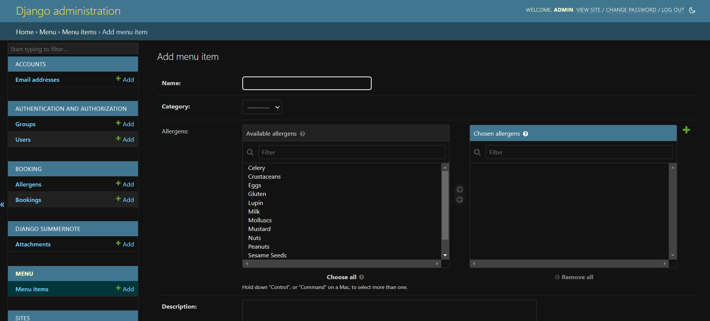 |
| As a site admin | I would like to edit menu items| so that I can change information of an existing menu item, for example; if the recipe changed which changed the allergen information. | 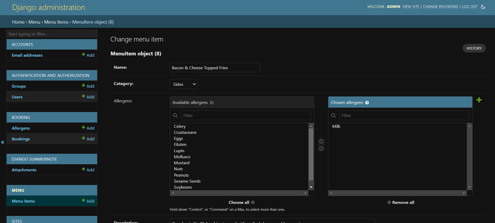 |
| As a site admin | I would like to view menu items| so that I see all of the menu items in one place. |  |
| As a site admin | I would like to delete menu items| so that I can remove discontinued item from the menu. |  |
| As a site admin | I would like to create bookings| so that I can create a booking on behalf of a customer who books via telephone or email. |  |
| As a site admin | I would like to edit bookings| so that I can edit a booking on behalf of a customer who books via telephone or email. | 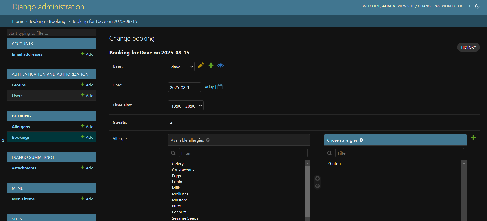 |
| As a site admin | I would like to view bookings| so that I can plan accordingly few upcoming bookings. | 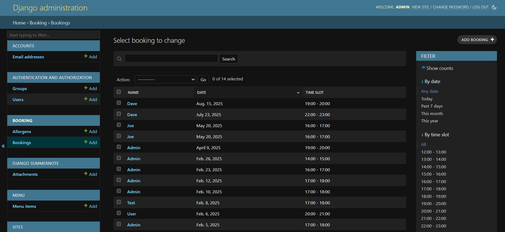 |
| As a site admin | I would like to delete bookings| so that I can cancel a booking on behalf of a customer who books via telephone or email. |  |
| As a site admin | I would like the site to prevent overbooking| so that I don't have to manually go through bookings to inform customers if we are fully booked. | Not Implimented |
| As a registered user | I would like to log in to the site | so that I can create & manage bookings. |  |
| As a registered user | I would like to log out of my account | so that I can ensure my account is secure when not in use. |  |
| As a registered user | I would like to create bookings | so that I can reserve a table at the resturant for a desired date/timeslot. |  |
| As a registered user | I would like to view an list of my upcoming bookings (ordered by most recent) | so that I can see all my upcoming bookings in one place. | 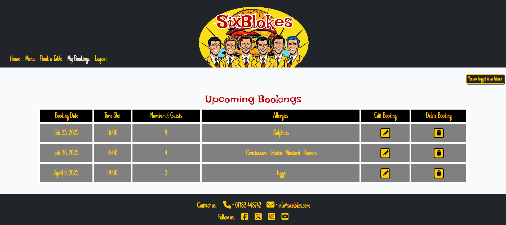 |
| As a registered user | I would like my modify my existing bookings | so that I can adjust parts of my booking without having to create a new one if my plans change. |  |
| As a registered user | I would like delete my existing bookings | so that I can cancel a booking if I can no longer attend. | 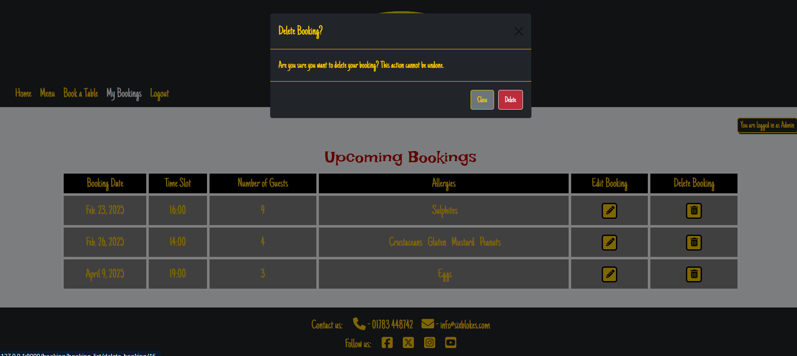 |
| As a registered user | I would like to see the availibility of timeslots when booking | so that I know if the timeslot if free. | Not Implimented |
| As a guest user | I would like to register for an account | so that I can create and manage bookings. |  |
| As a user | I would like to view the menu | so that I can see what the resturant has to offer. |  |
| As a user | I would like to view a homepage | so that I can read about the resturant, and what it specialises in. | 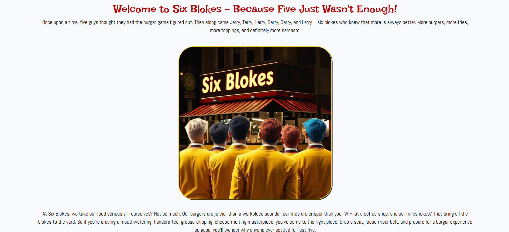 |
| As a user | I would like to see be able to contact the resturant | so that I can make bookings over the phone or by email. |  |
| As a user | I would like the site to scale correctly to my device size | so that I can comfortably view/use the site on all of my devices. | 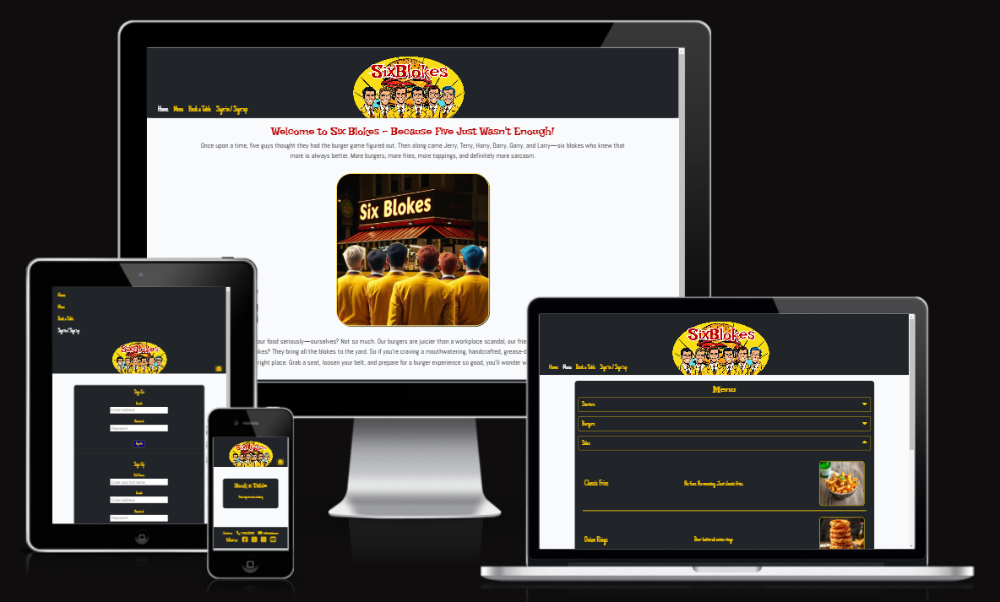 |
| As a user | I would like to see links to the resturant's social media pages| so that I can follow them for news on any upcoming event, offers, menu changes, etc... |  |
| As a user | I would like to see a 404 error page if I get lost | so that it's obvious that I've stumbled upon a page that doesn't exist. | 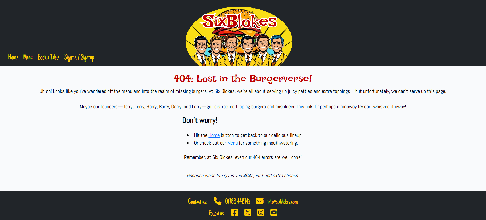 |
| As a developer | I would like to see a README file | so that I can famliarise myself with all of the site's features, database schema, and any know issues/bugs before making contributions. | [GitHub - README](https://github.com/Ash-5p/six-blokes/blob/main/README.md) |
| As a developer | I would like to see a TESTING file | so that I can see a document of all tests that have been conducted on the sites features, so I know they work as intened, and am aware of any known bugs. | [GitHub - TESTING](https://github.com/Ash-5p/six-blokes/blob/main/TESTING.md) |
| As a developer | I can deploy the site to Heroku | so that I can test the features of the website through the develpment process, and test it on multiple browsers. | [Heroku - Live Site](https://six-blokes-6958fc1bfc25.herokuapp.com/) |

## Automated Testing

I have conducted a series of automated tests on my application.

> [!NOTE]
> I fully acknowledge and understand that, in a real-world scenario, an extensive set of additional tests would be more comprehensive.

### Python (Unit Testing)

⚠️ INSTRUCTIONS ⚠️

Adjust the code below (file names, function names, etc.) to match your own project files/folders. Use these notes loosely when documenting your own Python Unit tests, and remove/adjust where applicable.

⚠️ SAMPLE ⚠️

I have used Django's built-in unit testing framework to test the application functionality. In order to run the tests, I ran the following command in the terminal each time:

- `python3 manage.py test name-of-app`

To create the coverage report, I would then run the following commands:

- `pip3 install coverage`
- `pip3 freeze --local > requirements.txt`
- `coverage run --omit=*/site-packages/*,*/migrations/*,*/__init__.py,env.py,manage.py test`
- `coverage report`

To see the HTML version of the reports, and find out whether some pieces of code were missing, I ran the following commands:

- `coverage html`
- `python3 -m http.server`

Below are the results from the full coverage report on my application that I've tested:


#### Unit Test Issues

⚠️ INSTRUCTIONS ⚠️

Use this section to list any known issues you ran into while writing your Python unit tests. Remember to include screenshots (where possible), and a solution to the issue (if known). This can be used for both "fixed" and "unresolved" issues. Remove this sub-section entirely if you somehow didn't run into any issues while working with your tests.

⚠️ --- END --- ⚠️

## Bugs

⚠️ INSTRUCTIONS ⚠️

Nobody likes bugs,... except the assessors! Projects seem more suspicious if a student doesn't properly track their bugs. If you're about to submit your project without any bugs listed below, you should ask yourself why you're doing this course in the first place, if you're able to build this entire application without running into any bugs. The best thing you can do for any project is to document your bugs! Not only does it show the true stages of development, but think of it as breadcrumbs for yourself in the future, should you encounter the same/similar bug again, it acts as a gentle reminder on what you did to fix the bug.

If/when you encounter bugs during the development stages of your project, you should document them here, ideally with a screenshot explaining what the issue was, and what you did to fix the bug.

Alternatively, an improved way to manage bugs is to use the built-in **[Issues](https://www.github.com/Ash-5p/six-blokes/issues)** tracker on your GitHub repository. This can be found at the top of your repository, the tab called "Issues".

If using the Issues tracker for bug management, you can simplify the documentation process for testing. Issues allow you to directly paste screenshots into the issue page without having to first save the screenshot locally. You can add labels to your issues (e.g. `bug`), assign yourself as the owner, and add comments/updates as you progress with fixing the issue(s). Once you've solved the issue/bug, you should then "Close" it.

When showcasing your bug tracking for assessment, you can use the following examples below.

⚠️ --- END --- ⚠️

### Fixed Bugs

[](https://www.github.com/Ash-5p/six-blokes/issues?q=is%3Aissue+is%3Aclosed+label%3Abug)

I've used [GitHub Issues](https://www.github.com/Ash-5p/six-blokes/issues) to track and manage bugs and issues during the development stages of my project.

All previously closed/fixed bugs can be tracked [here](https://www.github.com/Ash-5p/six-blokes/issues?q=is%3Aissue+is%3Aclosed+label%3Abug).


### Unfixed Bugs

⚠️ INSTRUCTIONS ⚠️

You will need to mention any unfixed bugs and why they are not fixed upon submission of your project. This section should include shortcomings of the frameworks or technologies used. Although time can be a big variable to consider, paucity of time and difficulty understanding implementation is not a valid reason to leave bugs unfixed. Where possible, you must fix all outstanding bugs, unless outside of your control.

If you've identified any unfixed bugs, no matter how small, be sure to list them here! It's better to be honest and list them, because if it's not documented and an assessor finds the issue, they need to know whether or not you're aware of them as well, and why you've not corrected/fixed them.

⚠️ --- END --- ⚠️

[](https://www.github.com/Ash-5p/six-blokes/issues)

Any remaining open issues can be tracked [here](https://www.github.com/Ash-5p/six-blokes/issues).


### Known Issues

| Issue | Screenshot |
| --- | --- |
| On devices smaller than 375px, the page starts to have horizontal `overflow-x` scrolling. |  |
| When validating HTML with a semantic `<section>` element, the validator warns about lacking a header `h2-h6`. This is acceptable. |  |
| Validation errors on "signup.html" coming from the Django Allauth package. |  |

> [!IMPORTANT]
> There are no remaining bugs that I am aware of, though, even after thorough testing, I cannot rule out the possibility.

